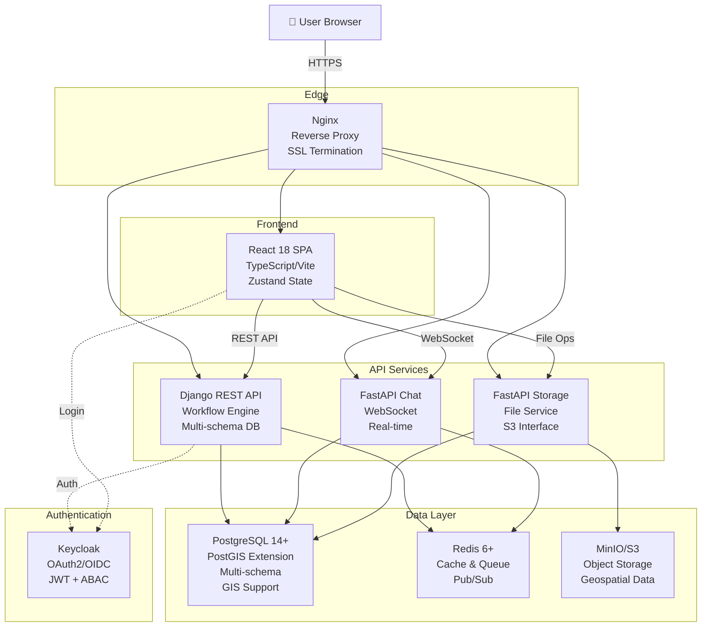

# GeoDataHub ERM - Complete Platform Documentation

This comprehensive documentation covers all components of the GeoDataHub ERM platform developed by the Hellenic Space Center's satellite data ordering and cataloguing system.

## What is GeoDataHub ERM?

GeoDataHub ERM (Enterprise Resource Management) is a sophisticated, multi-service platform designed to streamline the process of ordering, processing, and delivering Earth Observation (EO) satellite data. Built on a modern microservices architecture with Django, FastAPI, React, and Postgres, it provides a robust, scalable solution for managing complex data acquisition workflows across multiple integrated services.

## Platform Components

The ERM is built on a multi-service microservices architecture:

### 🔧 API Core Service

- **Django REST Framework** - Main API and workflow engine with PostgreSQL + PostGIS
- **Workflow engine** - Visual workflow designer with multi-node state machine
- **Business logic** - Orders, data providers, notifications, webhooks
- **Multi-tenant support** - Organization-based data segregation

### 💻 Frontend Service

- **React + TypeScript + Vite** - Modern web interface with rich interactivity
- **Responsive design** - Desktop and tablet optimized experience
- **Real-time updates** - WebSocket integration for live notifications
- **Zustand state management** - Efficient client-side state handling

### 💬 Chat Service

- **FastAPI + WebSocket** - Real-time communication platform
- **Redis pub/sub** - Scalable message distribution
- **Chat rooms** - Collaborative communication for orders and workflows
- **Message history** - Persistent message storage

### 📦 File Storage Service

- **FastAPI** - Dedicated file management microservice
- **S3/MinIO integration** - Scalable object storage
- **Presigned URLs** - Secure temporary file access
- **Multi-format support** - Handle various geospatial and data formats

## Key Features

### 🛰️ Satellite Data Ordering

- **Multi-provider support**: Integration with various satellite data providers (Planet, Sentinel, etc.)
- **Product catalog**: Comprehensive database of available satellite imagery products
- **Advanced search**: Geographic and temporal filtering for data discovery
- **Stock imagery**: Access to existing processed datasets

### 🔄 Workflow Engine

- **Visual workflow designer**: Create complex approval and processing workflows
- **Multi-node state machine**: Support for forms, transitions, notifications, webhooks, and more
- **Dynamic routing**: Conditional branching based on data values
- **Auto-assignment**: Intelligent operator assignment
- **Custom nodes**: Extensible architecture for custom workflow nodes

### 🔐 Security & Access Control

- **Keycloak integration**: Enterprise-grade OAuth2/OIDC authentication
- **ABAC policies**: Attribute-based access control for fine-grained permissions
- **Role-based access**: ADMIN, SUPERVISOR, OPERATOR, AUTHORIZED, ANONYMOUS roles
- **Comprehensive audit**: Complete field-level change tracking with timestamps

### 🔌 Integration Capabilities

- **EOFARM BPM Engine**: Automated data retrieval via BPMN workflows
- **Axis-3 Hub**: External satellite tasking system integration
- **S3 Storage**: Scalable file storage with presigned URLs
- **Webhooks**: Real-time notifications to external systems
- **Email templates**: Rich email notifications with variable substitution
- **Real-time chat**: Integrated communication platform

### 📊 Enterprise Features

- **Multi-tenant**: Organization-based data segregation
- **Audit logging**: Field-level change tracking with timestamps
- **Deliverables management**: Track and distribute processed data
- **Analytics**: Usage tracking and reporting
- **Export capabilities**: Excel and custom format exports
- **Scalable architecture**: Microservices design for horizontal scaling

## Architecture Overview

The platform is built on a **multi-service microservices architecture** with service isolation and inter-service communication:



## Design Principles

### Microservices Architecture

- **Service Isolation**: Each service manages its own data and responsibilities
- **Independent Scaling**: Services scale based on individual load
- **Resilient Communication**: Services communicate via REST APIs and message queues
- **Polyglot Services**: Different frameworks used where optimal (Django for complex logic, FastAPI for speed)

### Database Strategy

- **PostgreSQL Multi-Schema**: Core and app schemas for data isolation
- **PostGIS Integration**: Native geospatial query support for AOI (Area of Interest) operations
- **UUID Primary Keys**: Privacy-preserving identifiers across all models
- **Audit-First Design**: All changes tracked with timestamps and principals

### Authentication & Authorization

- **Keycloak SSO**: Enterprise-grade identity management with OAuth2/OIDC
- **JWT Tokens**: Stateless authentication for scalability
- **ABAC Policies**: Attribute-based access control for fine-grained permissions
- **Service-to-Service Auth**: Internal service communication via client credentials

### Real-Time Communication

- **WebSocket Integration**: Live updates for chat and notifications
- **Redis Pub/Sub**: Scalable message distribution for multi-instance deployments
- **Message Persistence**: Chat history maintained in PostgreSQL
- **Presence Tracking**: User availability and connection status

## Technology Stack

- **Frontend**: React 18+, TypeScript, Vite, Zustand, Tailwind CSS
- **API Server**: Django 4.2+, Django REST Framework 3.14+, GeoDjango
- **Chat Service**: FastAPI, WebSocket, SQLAlchemy
- **Storage Service**: FastAPI, S3/MinIO, SQLAlchemy
- **Authentication**: Keycloak OAuth2/OIDC, JWT
- **Database**: PostgreSQL 12+ with PostGIS extension, multi-schema support
- **Task Queue**: Celery with Redis broker
- **Cache**: Redis
- **API Documentation**: drf-yasg (Swagger/OpenAPI)
- **Container Orchestration**: Docker & Docker Compose
- **Proxy**: Nginx with SSL/TLS

## Quick Start

- [**Getting Started Guide**](getting-started/overview.md) - Installation and initial setup
- [**User Guide**](user-guide/overview.md) - Complete guide with screenshots and examples
- [**Architecture Overview**](architecture/overview.md) - Understand the system design
- [**Workflow System**](core-concepts/workflows.md) - Learn about the workflow engine
- [**Development Setup**](developer/setup.md) - Set up your development environment

## Documentation Structure

This documentation is organized into several sections covering all platform components:

**Getting Started** - Installation, configuration, and initial setup for the entire platform

**User Guide** - Comprehensive guide with screenshots and examples on using all platform features:

- Dashboard and navigation
- Creating and managing orders
- Working with workflows
- Collaborating via chat
- Managing files and deliverables
- Reporting and analytics

**Architecture** - System design and component overview:

- System architecture overview
- Django applications structure
- Database schema and multi-schema design
- Service integration patterns
- Infrastructure and deployment

**Core Concepts** - Deep dive into platform functionality:

- Workflows and state machines
- Orders and applications
- Forms and data collection
- Node types and custom nodes
- Order lifecycle

**API Reference** - Complete endpoint documentation:

- API overview and authentication
- Applications/Orders endpoints
- Workflows endpoints
- Data Providers endpoints
- Deliverables endpoints
- Notifications endpoints
- Webhooks endpoints
- User management endpoints

**Frontend Guide** - React frontend documentation:

- Architecture and folder structure
- State management with Zustand
- Component library and patterns
- Styling with Tailwind CSS
- WebSocket integration
- Building and deployment

**Chat Service** - Real-time communication service:

- Chat service overview
- WebSocket API
- Message storage
- Integration with orders
- Redis pub/sub architecture

**File Storage Service** - File management microservice:

- Storage service overview
- File upload/download API
- S3/MinIO integration
- Presigned URL generation
- Multi-format support

**Authentication & Authorization** - Security implementation:

- Authentication overview
- Keycloak integration and setup
- ABAC policies
- Roles and permissions

**Integrations** - External system integration:

- EOFARM BPM Engine
- Axis-3 Hub
- Email templates
- External webhooks
- Storage integration

**Developer Guide** - Development and extending:

- Development environment setup
- Code structure and conventions
- Testing strategies
- Creating custom workflows
- Custom node development
- Services layer architecture

**Deployment** - Production deployment:

- Environment configuration
- Docker deployment
- Kubernetes deployment
- Database setup and migrations
- Monitoring and logging
- SSL/TLS configuration

**Reference** - Additional resources:

- Settings reference
- Models reference
- Glossary and terminology

## Support & Contributing

For issues, questions, or contributions, please visit the [GitHub repository](https://github.com/HellenicSpaceCenter/geodatahub-erm).

## License

This project is developed and maintained by the **Hellenic Space Center**.

---

_Last updated: 2026-02-04_

```

```
