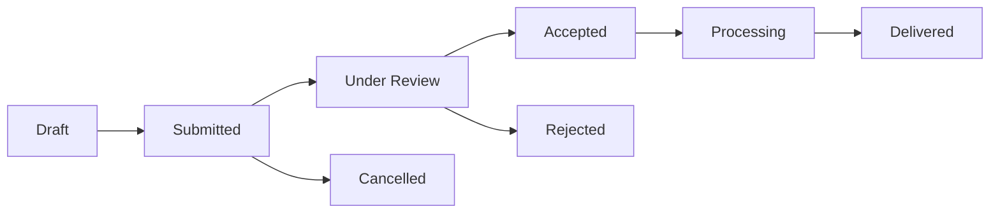

# Orders

Orders are the core unit of work in GeoDataHub. Each order represents a request for satellite data — either from existing archives or through a future satellite acquisition.

---

## What Is an Order?

An order is a formal request submitted to the Hellenic Space Center that specifies:

- The **geographic area** you need data for
- The **time period** of interest
- The **type of satellite data** required (optical, thermal, radar)
- Additional parameters such as resolution, cloud cover tolerance, and sensor angle

Once submitted, the HSC reviews your order and proceeds through a defined processing workflow until your data is delivered.

---

## Order Lifecycle

Every order passes through a series of steps. You can track progress through each step from the order details page.

| Status | Description |
|--------|-------------|
| **Draft** | The order has been created but not yet submitted. You can still edit all fields. |
| **Submitted** | The order has been sent to the Hellenic Space Center. Awaiting review. |
| **Under Review** | HSC is reviewing your order requirements. |
| **Accepted** | HSC has accepted the order and begun processing or tasking. |
| **Processing** | Data is being acquired or prepared. |
| **Delivered** | Data is available for download. |
| **Cancelled** | The order was cancelled before acceptance. |
| **Rejected** | HSC was unable to fulfil the order requirements. |

!!! info "Cancellation window"
    An order can only be cancelled while it is in **Submitted** status — after HSC has received it but before they have accepted it and moved it forward. Once accepted, cancellation is no longer available.

---

## Order Types

GeoDataHub supports two distinct types of orders, determined by the date range you select:

=== ":material-archive: Archival Order"

    A request for **data that already exists**. 

    - The acquisition date falls entirely in the **past**
    - HSC will search their catalog and third-party archives
    - If matching data exists, it will be provided directly
    - If no matching data is found in the catalog, HSC may source it from an external provider

=== ":material-satellite-uplink: Tasking Order"

    A request for **data that does not yet exist**.

    - The acquisition date falls in the **future**
    - HSC will either task the Greek microsatellite constellation or place a tasking order with a commercial provider
    - Fulfillment time depends on satellite pass scheduling

!!! tip "Not sure which type you need?"
    When creating a new order, the platform automatically determines the order type based on the date range you select. If your start date is in the past, it becomes an archival order. If your start date is today or in the future, it becomes a tasking order.

---

## In This Section

| Page | Description |
|------|-------------|
| [Managing Orders](managing-orders.md) | View, filter, sort, and act on your existing orders |
| [Placing an Order](placing-orders.md) | Create a new satellite data request using the map interface |
| [Order Specification](order-specification.md) | Complete the detailed order form and submit to HSC |
